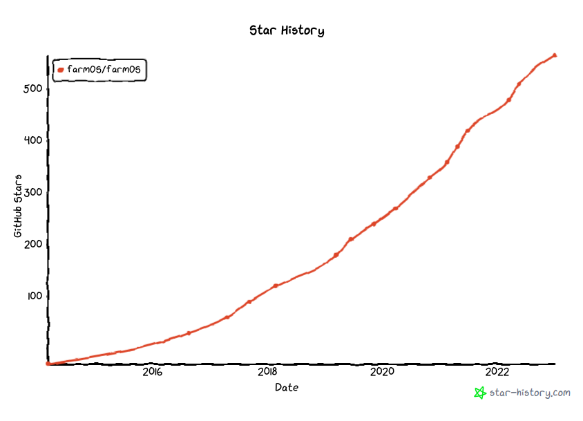

# A new chapter

Exactly one year after the [first beta release](https://github.com/farmOS/farmOS/releases/tag/2.0.0-beta1)
(and almost [3 years of development](https://github.com/farmOS/farmOS/graphs/contributors),
[many pre-releases](https://github.com/farmOS/farmOS/releases),
[countless bug fixes, new features, and a bit of polish](https://github.com/farmOS/farmOS/blob/2.0.0/CHANGELOG.md)),
the farmOS community is proud to announce the official release of
[farmOS 2.0.0](https://github.com/farmOS/farmOS/releases/tag/2.0.0)!

This is a symbolic release, signifying that farmOS v2 is no longer in "beta". If
you've been following the development process, you'll know that this isn't a
big change. farmOS v2 has been "stable" for a while, and many are already
building their record-keeping workflows on top of it. While the version change
seems small, it is the culmination of years of hard work, discussions,
decisions, and commits
([7548](https://github.com/farmOS/farmOS/commits/2.0.0) to be exact).

Moving forward, smaller and more frequent releases are expected, using
[semantic versioning](https://semver.org/) to indicate bug fixes, new features,
and breaking changes. Releases will be announced via the farmOS microblog, which
broadcasts to both [@farmOS@fosstodon.org](https://fosstodon.org/@farmOS) on
Mastodon, and [@farmOSorg](https://twitter.com/farmOSorg) on Twitter. We will
also use the microblog for other community news and announcements, so be sure to
follow along!

## Notable changes

In March 2022, on the heels of 2.0.0-beta1, we presented an in-depth overview of
farmOS v2's new features, changes, and improvements as part of the
[OpenTEAM In-Depth Learning Series](https://openteam.community/in-depth/). The
recording is embedded below, followed by an overview of notable changes since
farmOS v1.

<iframe width="560" height="315" src="https://www.youtube.com/embed/bruJH5ubBuA" title="YouTube video player" frameborder="0" allow="accelerometer; autoplay; clipboard-write; encrypted-media; gyroscope; picture-in-picture" allowfullscreen></iframe>

- Data model
  - [Documented data model](https://farmOS.org/model)
  - [Areas are now types of Assets](https://farmos.org/development/api/changes/#areas)
  - New Asset types: Land, Structure, Water, Material, Seed
  - Planting Assets are renamed to Plant
  - New Log types: Lab test (merged Soil and Water tests)
  - [Inventory tracking](https://farmos.org/model/logic/inventory/) for all
    Asset types
  - Improved [Asset location](https://farmos.org/model/logic/location/) logic,
    including the ability to designate Assets as "fixed" (with intrinsic
    geometry) and/or "locations" (allowing other Assets to be moved to them)
  - Improved [Group membership](https://farmos.org/model/logic/group/) logic,
    including member inheritence of group location
  - Support for [Quantity types](https://farmos.org/model/type/quantity/#type)
  - Revisions for tracking changes to records
  - Improved "Data streams" framework for sensors and other time-series data
    collection
  - ID tags on all Asset types
  - Flags can be limited by record type
- User interface/experience (UI/UX)
  - Improved location hierarchy drag-and-drop editor, including ability to edit
    sub-hierarchies
  - Improved KML/KMZ importer for bulk Land Asset creation
  - Geocoding of GeoJSON and GPX files (in addition to KML/KMZ) on individual
    Assets and Logs
  - Farm settings UI with simplified module installer
  - [Gin](https://www.lullabot.com/podcasts/lullabot-podcast/gin-admin-theme-drupals-future-ui)
    admin theme
  - Improved mobile support
- APIs, libraries, and developer experience (DX)
  - [Documented API changes](https://farmos.org/development/api/changes/)
  - Modernized RESTful API built on [JSON:API](https://jsonapi.org/)
  - [JSON Schema](https://json-schema.org/) for all API resources
  - 2.x API support in [farmOS.js](https://github.com/farmOS/farmOS.js) and
    [farmOS.py](https://github.com/farmOS/farmOS.py) libraries
  - Updated [farmOS-map](https://github.com/farmOS/farmOS-map) library based on
    [OpenLayers](https://openlayers.org/)
  - Improved APIs for [module builders](https://farmos.org/development/module/)
  - Object-oriented architecture based on [Symfony](https://symfony.com/)
  - Dependency management via [Composer](https://getcomposer.org/)
  - Automated testing via [PHPUnit](https://phpunit.de/) and
    [GitHub Actions](https://github.com/farmOS/farmOS/actions)
  - Coding standards enforcement via [CodeSniffer](https://github.com/squizlabs/PHP_CodeSniffer)
  - Feature branch previews via [Tugboat](https://www.tugboat.qa/)
- Hosting
  - PostgreSQL database support (alongside MySQL, MariaDB, and SQLite3)
  - [Automated migration](https://farmos.org/hosting/migration/) from 1.x to 2.x
  - Improved performance with lazy-loading code and caching options
  - Improved support for translation/localization (l10n)
- Security
  - Support from the [Drupal Security Team](https://www.drupal.org/drupal-security-team)
  - Drupal 9 will be supported (with security updates) until November 2023.
  - Drupal 10 was released December 15th, 2022. The farmOS update process will
    be trivial compared to the upgrade from Drupal 7, which required a complete
    refactor of the codebase. By comparison, updating from Drupal 9 to 10 will
    simply involve updating deprecated code.

## Next steps

2023 is going to be a fun year for farmOS development. We have big plans and
some exciting news to share soon! So stay tuned!

Some of our next priorities include new crop and grazing planning modules, more
quick forms, new integrations with third-party services and models, development
and documentation of standard record-keeping
[conventions](https://farmos.org/model/convention/), and much much more.

If you have ideas, we welcome you to join us in the farmOS community
[forum](https://farmos.discourse.group/),
[monthly calls](https://farmos.org/community/monthly-call/), and
[chat room](https://app.element.io/#/room/#farmOS:matrix.org). We've had so many
great conversations and brainstorms in 2022, and I expect 2023 will bring even
more!

## Thanks

We couldn't have done all of this without the generous support and contributions
of our community. farmOS v2 had more contributors than ever before, and our base
of users, developers, and backers continues to grow.

Special thanks to Paul Weidner, Jamie Gaehring, Symbioquine, Pedro Cambra, Greg
Austic, Dorn Cox, [Wolfe's Neck Center](https://www.wolfesneck.org/),
the [Foundation for Food & Agriculture Research](https://foundationfar.org/),
[Our Sci](https://www.our-sci.net/),
[Rothamsted Research](https://www.rothamsted.ac.uk/), all of the regulars on
our community calls (you know who you are!), and all of our
[OpenCollective backers](https://opencollective.com/farmOS).

If you would like to help support the continued development of farmOS and its
community, please consider sponsoring our work:
[farmOS.org/donate](https://farmos.org/donate/)

Thank you and Happy New Year! 🎉
